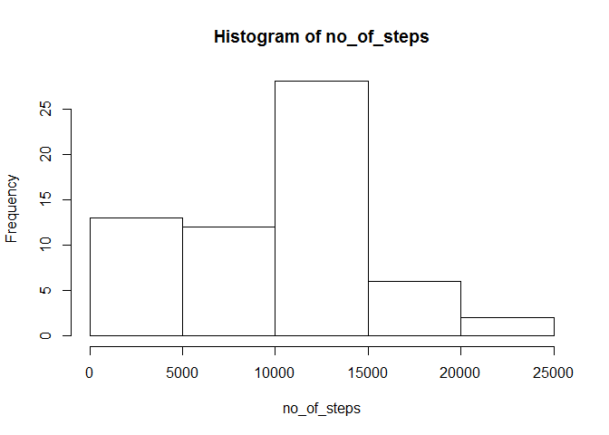
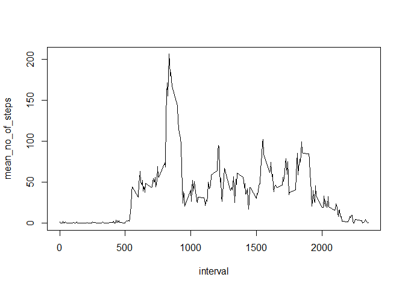
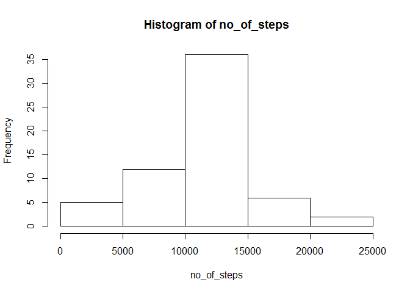
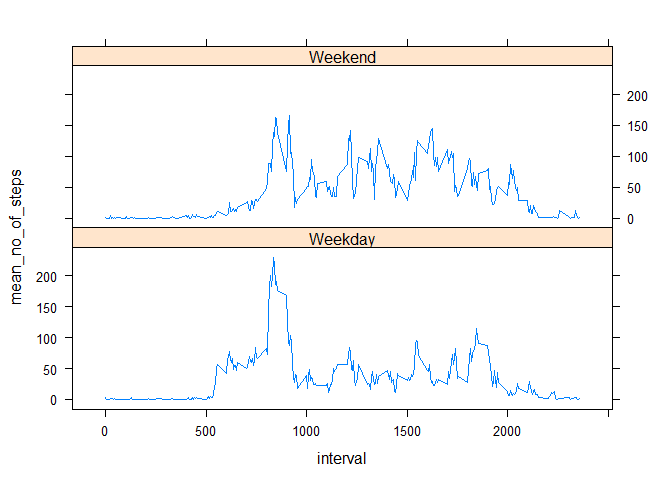

# Reproducible Research: Peer Assessment 1


## Loading and preprocessing the data

```
## 
## Attaching package: 'dplyr'
## 
## The following object is masked from 'package:stats':
## 
##     filter
## 
## The following objects are masked from 'package:base':
## 
##     intersect, setdiff, setequal, union
```

```r
data <- read.csv("./activity.csv")
```

## What is mean total number of steps taken per day?

We group the data by day and take the mean and median of the total number of steps in a day. Also, plotting the histogram of the total number of steps

The mean and median are as printed below


```r
grouped_data <- group_by(data,date)
data_summary <- summarize(grouped_data,no_of_steps = sum(steps,na.rm = TRUE))
with(data_summary,hist(no_of_steps))
```

 

```r
print(mean(data_summary$no_of_steps))
```

```
## [1] 9354.23
```

```r
print(median(data_summary$no_of_steps))
```

```
## [1] 10395
```


## What is the average daily activity pattern?

We group the data by interval and take the mean of the no of steps in a particular interval and plot it.

As can be seen below, the highest steps are usually taken in the 835th interval


```r
grouped_data <- group_by(data,interval)
data_summary <- summarize(grouped_data,mean_no_of_steps = mean(steps,na.rm = TRUE))

with(data_summary,plot(interval,mean_no_of_steps,type = 'l'))
```

 

```r
print(data_summary$interval[match(max(data_summary$mean_no_of_steps),data_summary$mean_no_of_steps)])
```

```
## [1] 835
```


## Imputing missing values

Replacing the missing values with the mean number of steps by interval when an NA falls in one particaulr interval. We see that there are 2304 NA entries


```r
data2<-data
print(sum(is.na(data$steps)))
```

```
## [1] 2304
```

```r
data$mean_by_interval <- data_summary$mean_no_of_steps[match(data$interval,data_summary$interval)]

data2$steps[is.na(data2$steps)] <- data$mean_by_interval[is.na(data2$steps)]
```


When NAs have been replaced with values, we see that the mean has increased, as is to be expected since we have replaced null values with some positive values.


```r
grouped_data <- group_by(data2,date)
data_summary <- summarize(grouped_data,no_of_steps = sum(steps,na.rm = TRUE))
with(data_summary,hist(no_of_steps))
```

 

```r
print(mean(data_summary$no_of_steps))
```

```
## [1] 10766.19
```

```r
print(median(data_summary$no_of_steps))
```

```
## [1] 10766.19
```


## Are there differences in activity patterns between weekdays and weekends?

From the plots of Weekend vs Weekday, we observe that even though the Maximum number of steps is higher in the case of Weekday, the overall number of steps taken during a weekend is higher than weekday.


```r
data2$day_of_week <- weekdays(strptime(as.character(data2$date),"%Y-%m-%d"))

data2$WeekendDay <- factor(1*(data2$day_of_week=="Saturday" | data2$day_of_week=="Sunday"),labels = c("Weekday","Weekend"))

grouped_data <- group_by(data2,interval,WeekendDay)

data_summary <- summarize(grouped_data,mean_no_of_steps = mean(steps,na.rm = TRUE))

xyplot(mean_no_of_steps ~ interval| WeekendDay , data = data_summary, type = 'l', layout = c(1, 2))
```

 
